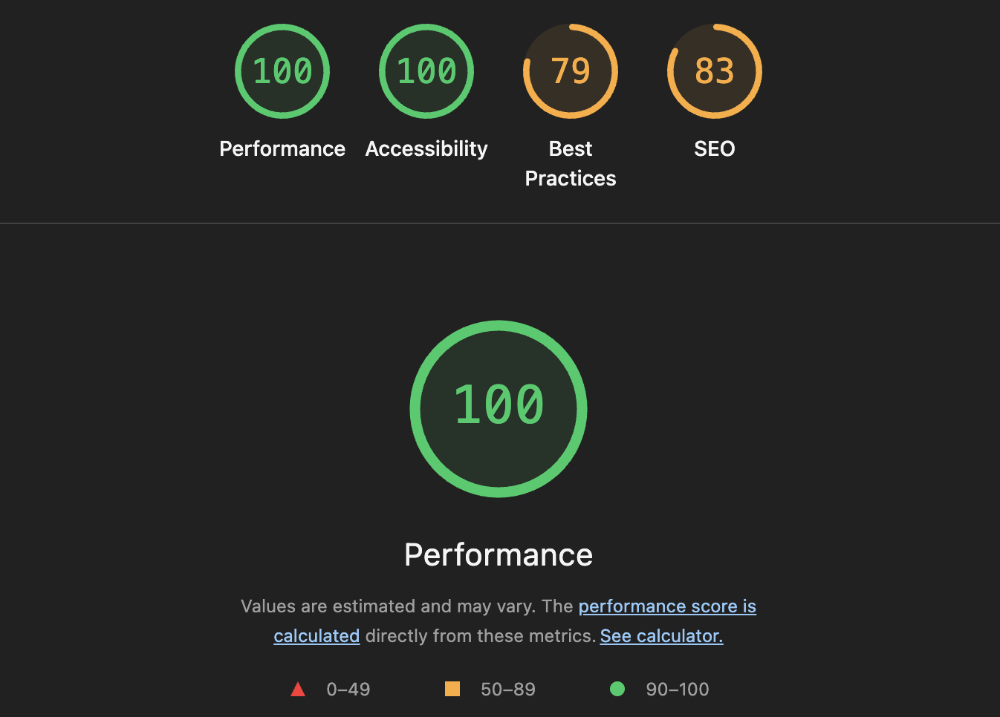

# Install

git clone https://github.com/dmitryreese/graphicnature.git

cd graphicnature

yarn (*alternatively `npm i`*)

yarn dev (*alternatively `npm run dev`*)

# Notes

Anything not implemented is pretty much the lack of time. Sorry

- **Features**
  - Accuweather API
  - Offline data (Browser console > Application > Local storage > Clear 'LOCATION')
  - Simple Geolocation denied / Loading / Error screens
  - No libraries (yeah, I know)
  - Pull Requests over at [https://github.com/dmitryreese/graphicnature/pulls](https://github.com/dmitryreese/graphicnature/pulls)

- **Missing features (in no particular order)**
  - Request caching (at this point should just go for RTK Query / TanStack Query)
  - Better typing
  - Further CSS optimization
  - Code is pretty WET (as opposed to DRY). To a reasonable level. I think
  - Components are still pretty brittle, could be split further
  - Further architecture improvement, but the general idea should be clear
  - Accuweather only allows 5 day / 12 hour on a free plan as opposed to required 10 day / 24 hour. Seemed like it didn't make that much of a difference so I've made a decision to leave it as is
  - As far as I could understand Accuweather has its own icons, not the ones initially provided. Accuweather icons are kind of "mapped" to use the icons provided
  - No precipitation either. Accuweather again
  - API_KEY is hardcoded. Accuweather only allows 50 requests a day, you should be good to go for all 50 of them. I recommend refreshing the application until you run out of them to see the error states
  - Better UX / UI / Error handling / App status. Again - just decided to leave it at a (hopefully) reasonable level
  - Wide screens adaptation
  - Didn't understand the "make the app installable" requirement
  - More than happy to answer any questions in case I forgot something

- **Lighthouse**
  - Taken from a "production build", Best Practices are actually slightly better because the build is served over HTTP when run locally

